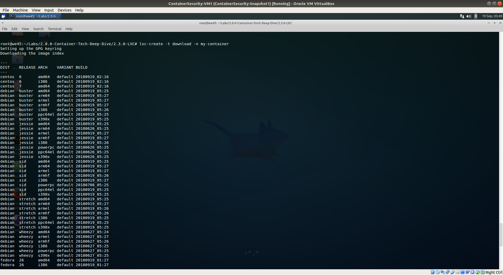
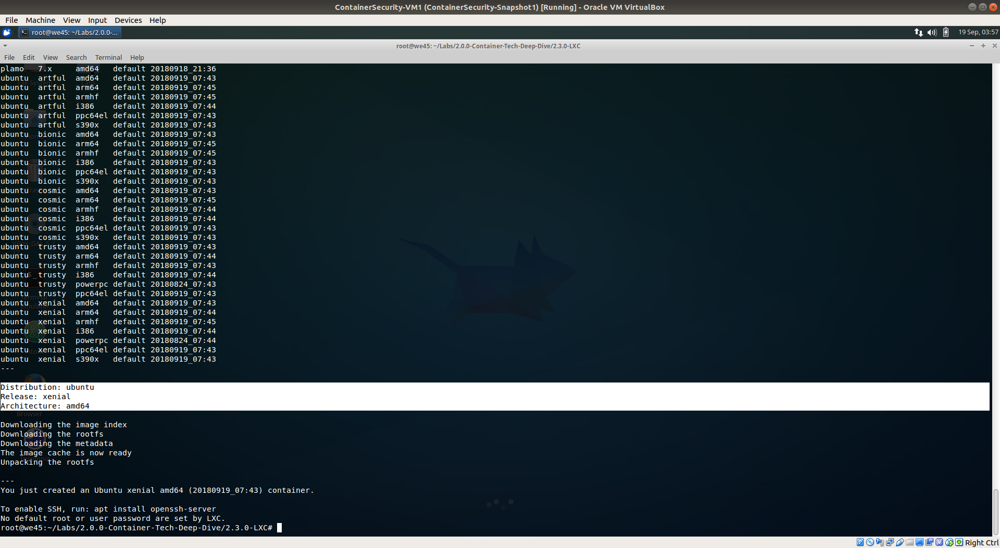
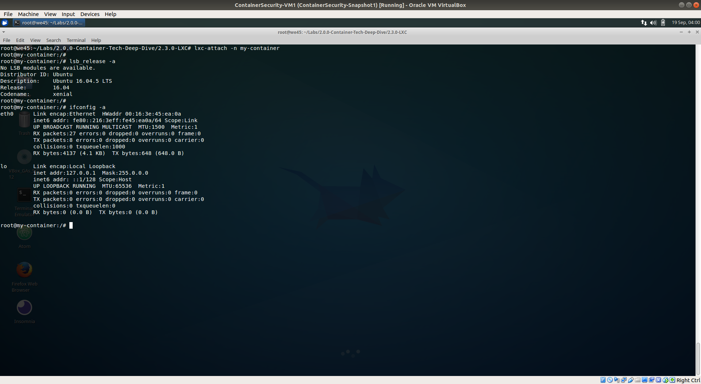
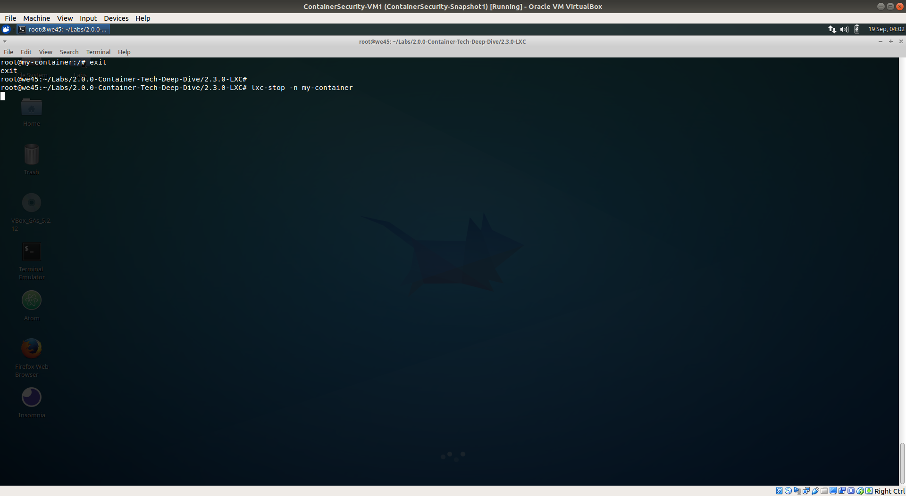
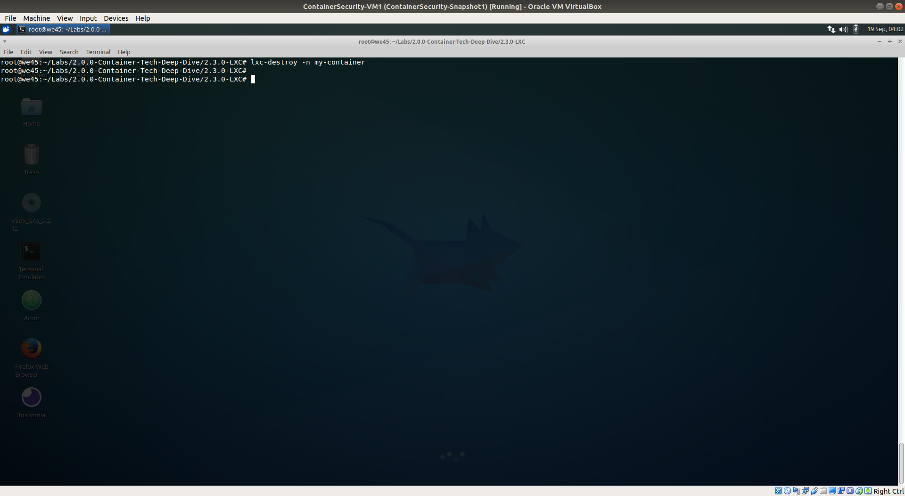

## LXC

##### Step 1:

* Open Terminal


##### Step 2:
*  **cd** into  `Labs/2.0.0-Container-Tech-Deep-Dive/2.3.0-LXC`

```cd Labs/2.0.0-Container-Tech-Deep-Dive/2.3.0-LXC```

##### Step 3:

Step 1: To create your first LXC container, run `lxc-create -t download -n my-container`



    
Step 2: The download template (`-t` flag in the command above) will give you options to select distribution, version, architecture. Select ubuntu, xenial and amd64 respectively.



    
Step 3: Once the download is complete, you can start the container by running `lxc-start -n my-container -d`. To confirm status of the container, run `lxc-info -n my-container`


Step 4: To get shell access to the container, run `lxc-attach -n my-container`.


    
Step 5: Commands like `ifconfig -a`, `lsb_release -a`, etc.. can be run inside the container.



    
Step 6: To exit from the container, run `exit`. Stop the container by running `lxc-stop -n my-container` 



    
Step 7: To remove and destroy the container, run `lxc-destroy -n my-container`


