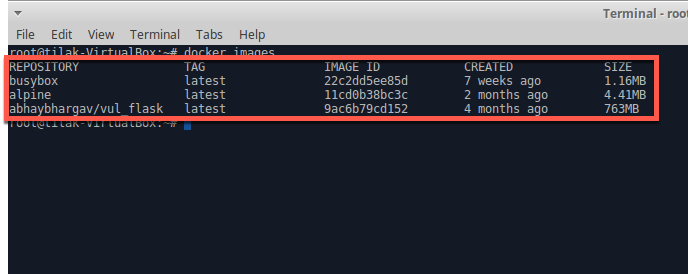
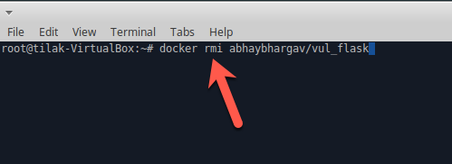

# Docker Hands-On Part-1

---

#####Step 1:
* Open Terminal

	

#####Step 2:
* Download docker image from Docker Hub

    * `docker pull abhaybhargav/vul_flask`
    
    
    
    
 
#####Step 3:   
* View list of docker images
    * `docker pull abhaybhargav/vul_flask`
    
    
    
#####Step 4:
* Start docker container 
   * `docker run -d --name vul_flask abhaybhargav/vul_flask`
    
   
 
#####Step 5:   
* List of running containers
   * `docker ps`
    
   
    
#####Step 6:   
* Exec into a container
   * `docker exec -it vul_flask bash`
    
   
   
#####Step 7:
* Exit from the container
   * `exit`
    
    

#####Step 8:   
* List of running containers
   * `docker ps`
    
   
   
#####Step 9:   
* Stop running container
   * `docker stop vul_flask`
    
      
    
#####Step 10:
* List of all containers including stopped and running containers
   * `docker ps -a`
    
   

#####Step 11:   
* Remove Stopped container
   * `docker rm vul_flask`
    
   

#####Step 12:
* Remove docker image
   * `docker rmi abhaybhargav/vul_flask`
    
   
