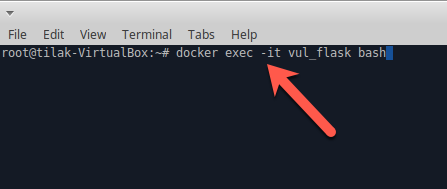

## Docker Hands-On Part-1

##### Step 1:

* Open Terminal

	

##### Step 2:

*  **cd** into  `/root/labs/container_training/Container/Docker-Hands-On`

    ```commandline
    cd /root/labs/container_training/Container/Docker-Hands-On
    ```

##### Step 3:

* Run `docker pull abhaybhargav/vul_flask` to download image from the Docker Hub.
    
    **Note:** If the docker image exists.
    
    ```commandline
      root@we45:~/container_training/Container/Container-Tech-Deep-Dive/Docker-Hands-On# docker pull abhaybhargav/vul_flask
      Using default tag: latest
      latest: Pulling from abhaybhargav/vul_flask
      Digest: sha256:a3fe27c223066aa605e3fca8d49fbe53ab26f39f89ed895485669239f6c433ae
      Status: Image is up to date for abhaybhargav/vul_flask:latest
    ```
    
    **Note:** If the docker image doesn't exists.
    
    ```commandline
    root@we45:~/container_training/Container/Container-Tech-Deep-Dive/Docker-Hands-On# docker pull abhaybhargav/vul_flask
    Using default tag: latest
    latest: Pulling from abhaybhargav/vul_flask
    f2b6b4884fc8: Pull complete 
    4fb899b4df21: Pull complete 
    74eaa8be7221: Pull complete 
    2d6e98fe4040: Pull complete 
    414666f7554d: Pull complete 
    bb0bcc8d7f6a: Pull complete 
    a571bb44bc32: Pull complete 
    aa6d783919f6: Pull complete 
    0ee3a581f2bb: Pull complete 
    a5d6a50d70cc: Pull complete 
    61a8bf1f518f: Pull complete 
    Digest: sha256:a3fe27c223066aa605e3fca8d49fbe53ab26f39f89ed895485669239f6c433ae
    Status: Downloaded newer image for abhaybhargav/vul_flask:latest
    
    ```
   
    

##### Step 4: 
  
* Run `docker images` to get list of images on the machine

    ```commandline
    root@we45:~/container_training/Container/Container-Tech-Deep-Dive/Docker-Hands-On# docker images
    REPOSITORY                     TAG                 IMAGE ID            CREATED             SIZE
    mongo                          latest              e3985c6fb3c8        2 weeks ago         381MB
    ubuntu                         16.04               b9e15a5d1e1a        2 weeks ago         115MB
    nginx                          latest              06144b287844        2 weeks ago         109MB
    postgres                       9                   01e1fdb168a4        2 weeks ago         229MB
    docker/docker-bench-security   latest              9845aeb4ed8d        6 weeks ago         32MB
    anchore/anchore-engine         latest              940c39377c1a        6 weeks ago         575MB
    sysdig/falco                   latest              48e977e1b431        7 weeks ago         694MB
    alpine                         latest              11cd0b38bc3c        2 months ago        4.41MB
    arminc/clair-local-scan        v2.0.1              84c42efb0397        3 months ago        387MB
    abhaybhargav/vul_flask         latest              9ac6b79cd152        5 months ago        763MB
    arminc/clair-db                2017-09-18          4eccc1042784        12 months ago       391MB
    
    ```
     
    
    
##### Step 5:

* Run `docker run -d --name vul_flask abhaybhargav/vul_flask` to start a docker container.

    ```commandline
    root@we45:~/container_training/Container/Container-Tech-Deep-Dive/Docker-Hands-On# docker run -d --name vul_flask abhaybhargav/vul_flask
    0c8c0c6a51226dad50b7d58a629cdd1dd3981dc1233e63788631552e1127abf0
    ```
      
    
 
##### Step 6:   

* Run `docker ps` to view, all running containers.

    ```commandline
    root@we45:~/container_training/Container/Container-Tech-Deep-Dive/Docker-Hands-On# docker ps
    CONTAINER ID        IMAGE                    COMMAND             CREATED             STATUS              PORTS               NAMES
    0c8c0c6a5122        abhaybhargav/vul_flask   "python app.py"     35 seconds ago      Up 34 seconds       5050/tcp            vul_flask
    ```
     
    
    
##### Step 7:  
 
* Run `docker exec -it vul_flask bash` to exec into a running container.

    ```commandline
    root@we45:~/container_training/Container/Container-Tech-Deep-Dive/Docker-Hands-On# docker exec -it vul_flask bash
    root@0c8c0c6a5122:/apps#
    ```
    
   
##### Step 8:

* Run `exit` to exit from the container.

    ```commandline
    root@0c8c0c6a5122:/apps# exit
    exit
    root@we45:~/container_training/Container/Container-Tech-Deep-Dive/Docker-Hands-On#
    ```
       
     

##### Step 9:   

* Run `docker ps` to view, all running containers.

    ```commandline
    root@we45:~/container_training/Container/Container-Tech-Deep-Dive/Docker-Hands-On# docker ps
    CONTAINER ID        IMAGE                    COMMAND             CREATED             STATUS              PORTS               NAMES
    0c8c0c6a5122        abhaybhargav/vul_flask   "python app.py"     35 seconds ago      Up 34 seconds       5050/tcp            vul_flask
    ```
     
    
   
##### Step 10: 
  
* Run `docker stop vul_flask` to stop the running container.

    ```commandline
    root@we45:~/container_training/Container/Container-Tech-Deep-Dive/Docker-Hands-On# docker stop vul_flask
    vul_flask
    ```
        
       
    
##### Step 11:

* Run `docker ps -a` to view all containers including stopped and running containers.

    ```commandline
    root@we45:~/container_training/Container/Container-Tech-Deep-Dive/Docker-Hands-On# docker ps -a
    CONTAINER ID        IMAGE                    COMMAND             CREATED             STATUS                            PORTS               NAMES
    0c8c0c6a5122        abhaybhargav/vul_flask   "python app.py"     7 minutes ago       Exited (137) About a minute ago                       vul_flask
    ```
    

##### Step 12:   

* Run `docker rm vul_flask` to remove stopped container.

    ```commandline
    root@we45:~/container_training/Container/Container-Tech-Deep-Dive/Docker-Hands-On# docker rm vul_flask
    vul_flask
    ```
    

##### Step 13:

* Run `docker rmi abhaybhargav/vul_flask` to remove docker image from the system.

    **Note:** Don't delete image from the VM
    
    ```commandline
    root@we45:~/container_training/Container/Container-Tech-Deep-Dive/Docker-Hands-On# docker rmi abhaybhargav/vul_flask
    Untagged: abhaybhargav/vul_flask:latest
    Untagged: abhaybhargav/vul_flask@sha256:a3fe27c223066aa605e3fca8d49fbe53ab26f39f89ed895485669239f6c433ae
    Deleted: sha256:9ac6b79cd152209c1311c319fd50658cf456ec3291e8b8803006ce3c8a51e506
    Deleted: sha256:f28ed4554f88595a6e2c9cdda7a9379d770e132075023bd75c665410e4da9785
    Deleted: sha256:a1bf2d56d3a0967a8759665a38fbeba058eadadfc84e0794ee7a45ebed4b2407
    Deleted: sha256:93bcaccf367717ab59fe78043d1219d0014d89331a8b7163ec9c07afc299ee96
    Deleted: sha256:0b6552e62b5f6cb884761259f784bb12e111d6f99a5008fd333732fa291cf4c5
    Deleted: sha256:1986850bc9fbc56dfd5f896ac76bd2a2bcbfa96fd63562c4b2efa5a35d09a848
    Deleted: sha256:e152b62f99fc384bbba7c692a07c0730aca46728fee5e5c562074f7814e50a53
    Deleted: sha256:1bff274cbad794856eacdda1200cca12c26000517f87b6cf77d88af6c6c8f0ac
    Deleted: sha256:6e288603e1fdc18e6eedf814bd390b3f52254ebc6d551b140720c326f86fb07f
    Deleted: sha256:3b621507b3aef842eee316b14b3310541a9886b6ddc4738eab6eecd365fb66de
    Deleted: sha256:2e0b525b0e10a34b5f3db0f9ffca94792c04683d42f795296116763c56f2603a
    Deleted: sha256:8fad67424c4e7098f255513e160caa00852bcff347bc9f920a82ddf3f60229de
    
    ```
       