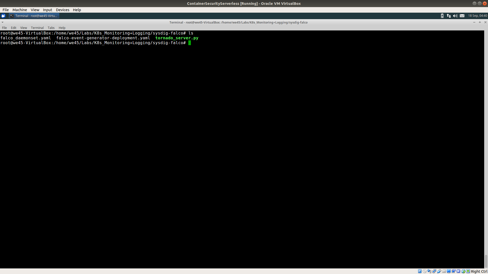
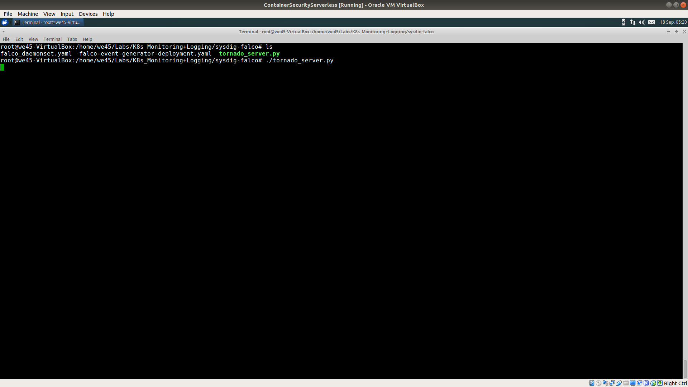
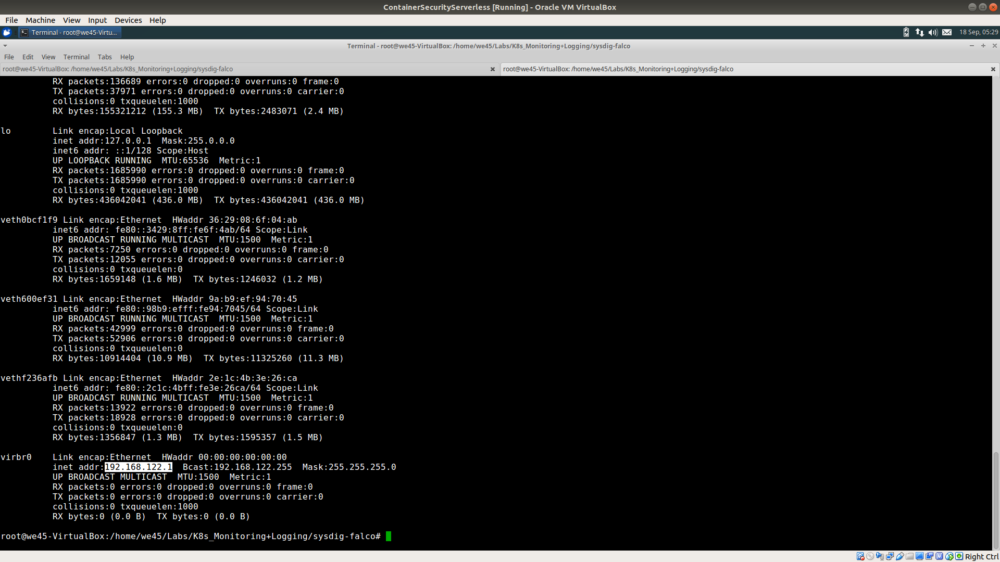
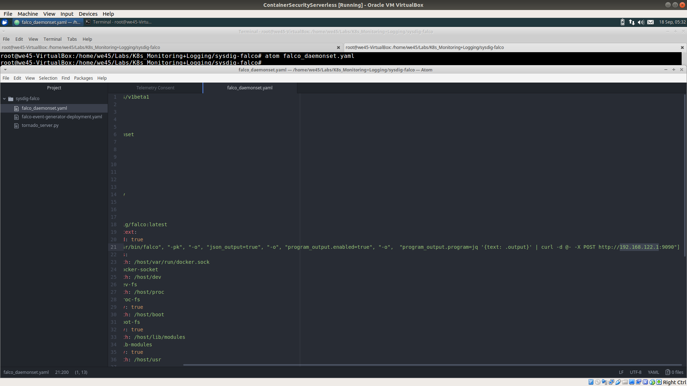
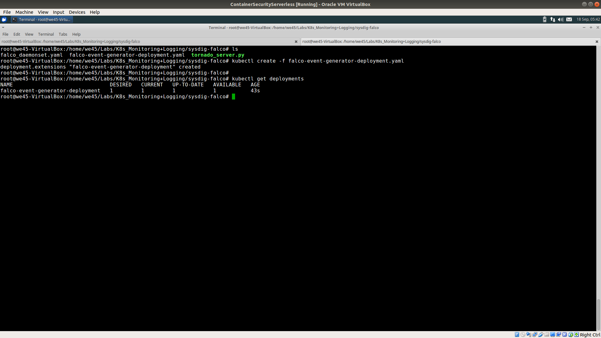
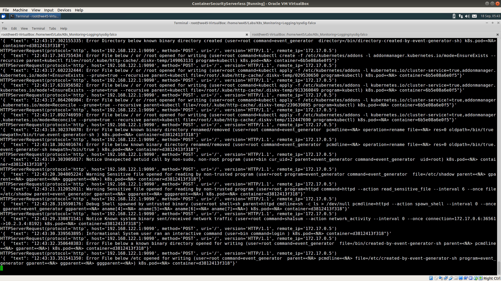

# **`Profiling and Logging - sysdig-falco`**

Step 1: Navigate to the directory that has sysdig-falco YAML files

Step 2: Start the tornado server by running `./tornado_server.py`

Step 3: Open a new tab on the terminal and run  `ifconfig` to get the ip address of the VM

Step 4: Run `atom falco_daemonset.yaml` to update the IP in curl command on line 21. Save and exit once IP has been updated.

Step 5: Run `kubectl create -f falco_daemonset.yaml` to create the daemonset and `kubectl get daemonsets` to verify

Step 6: Run `kubectl create -f falco-event-generator-deployment.yaml` to create pods that generate intentionally malicious events. Run `kubeclt get deployments` to verify.

Step 7: Go back to the tab running tornado server to see the real-time logs of malicious events.

